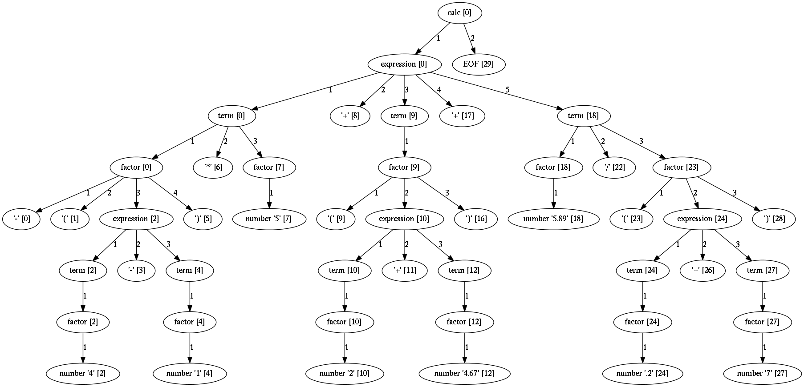

# Calculator tutorial

A tutorial for parsing and evaluation of arithmetic expressions.

---

In this tutorial we will make a parser and evaluator for simple arithmetic
expression (numbers and operations - addition, subtraction, multiplication and
division).  The parser will be able to recognize and evaluate following
expressions:

    2+7-3.6
    3/(3-1)+45*2.17+8
    4*12+5-4*(2-8)
    ...

Evaluation will be done using [support for semantic analysis](../semantics.md).

Parsing infix expression has additional constraints related to operator
precedence. Arpeggio is recursive-descent parser, parsing the input from left to
right and doing a leftmost derivation. 
There is a simple technique that will enable proper evaluation in the context
of a different operator precedence.


Let's start with grammar definition.

# The grammar

- Each `calc` file consists of one or more expressions.

```python
def calc():       return OneOrMore(expression), EOF
```

- Each expression is a sum or subtraction of terms.

```python
def expression(): return term, ZeroOrMore(["+", "-"], term)
```

- Each term is a multiplication or division of factors.

```python
def term():       return factor, ZeroOrMore(["*","/"], factor)
```

!!! note
    Notice that the order of precendence is from lower to upper.
    The deeper is the grammar rule, the tighter is the bonding.

- Each factor is either a number or an expression inside brackets. The prefix
  sign is optional. This is a support for unary minus.

```python
def factor():     return Optional(["+","-"]), [number, ("(", expression, ")")]
```

!!! note
    Notice indirect recursion here to `expression`. It is not left since the
    opening bracket must be found.

- And finally we define `number` using regular expression as

```python
def number():     return _(r'\d*\.\d*|\d+')
```

# The parser

Using above grammar specified in [Python
notation](../grammars.md#grammars-written-in-python) we instantiate the parser
using `ParserPython` class.

```python
  parser = ParserPython(calc)
```

This parser is able to parse arithmetic expression like this

```
-(4-1)*5+(2+4.67)+5.89/(.2+7)
```

and produce parse tree like this




!!! note
    All tree images in this documentation are produced by running the parser
    in [debug mode](../debugging.md) and using [visualization
    support](../debugging.md#visualization).

The parsing is done like this:

```python
input_expr = "-(4-1)*5+(2+4.67)+5.89/(.2+7)"
parse_tree = parser.parse(input_expr)
```

By ordering operation in the grammar form lower to upper precendence we have
got the parse tree where the priority is retained. This will help us to easier
make an expression evaluation.

# Evaluating parse tree

To implement evaluation we shall use Arpeggio's support for [semantic
analysis](../semantics.md) using visitor patter.

Visitor is an object with methods named `visit_<rule>` which gets called for 
each node of parse tree produced with the given rule. The processing of the 
tree nodes is done bottom-up.

```python
class CalcVisitor(PTNodeVisitor):

    def visit_number(self, node, children):
        """
        Converts node value to float.
        """
        return float(node.value)

    ...

```

Visit method for the `number` rule will do the conversion of the matched text
to `float` type. This nodes will always be the terminal nodes and will be
evaluated first.

```python

    def visit_factor(self, node, children):
        """
        Applies a sign to the expression or number.
        """
        if len(children) == 1:
            return children[0]
        sign = -1 if children[0] == '-' else 1
        return sign * children[-1]

```

Factor will have an optional sign as the first child and whatever matches first
from the ordered choice of number and expression.
We take the last element. It must be the result of `number` or `expression`
evaluation and apply an optional sing on it.

!!! note
    Note that the constant string matches will be removed by the Arpeggio, thus
    you will never get a constant string match in the children list.


```python

    def visit_term(self, node, children):
        """
        Divides or multiplies factors.
        Factor nodes will be already evaluated.
        """
        term = children[0]
        for i in range(2, len(children), 2):
            if children[i-1] == "*":
                term *= children[i]
            else:
                term /= children[i]
        return term
```

`term` consist of multiplication or divisions. Both operations are left
associative so we shall run from left to right. Each even element will be
evaluated `factor` while each odd element will be an operation to perform.
At the end we return the evaluated `term`.


```python
    def visit_expression(self, node, children):
        """
        Adds or substracts terms.
        Term nodes will be already evaluated.
        """
        expr = 0
        start = 0
        # Check for unary + or - operator
        if text(children[0]) in "+-":
            start = 1

        for i in range(start, len(children), 2):
            if i and children[i - 1] == "-":
                expr -= children[i]
            else:
                expr += children[i]

        return expr
```

And finally the whole expression consists of additions and subtractions of
terms. A minor glitch here is a support for unary minus and plus sign.


Let's apply this visitor to our parse tree.

```python
result = visit_parse_tree(parse_tree, CalcVisitor(debug=debug))
```

The result will be a `float` which represent the value of the given expression.

# The grammar in PEG

As a final note, the same grammar can be specified in [textual PEG
syntax](../grammars.md#grammars-written-in-peg-notations).

Either a clean PEG variant:

```
number = r'\d*\.\d*|\d+'
factor = ("+" / "-")?
          (number / "(" expression ")")
term = factor (( "*" / "/") factor)*
expression = term (("+" / "-") term)*
calc = expression+ EOF

```

or traditional PEG variant:

```
number <- r'\d*\.\d*|\d+';
factor <- ("+" / "-")?
          (number / "(" expression ")");
term <- factor (( "*" / "/") factor)*;
expression <- term (("+" / "-") term)*;
calc <- expression+ EOF;
```

The grammar for textual PEG is parsed using Arpeggio itself and this shows the
flexibility of the Arpeggio parser.

The code for both parser can be found in the [Calc
example](https://github.com/igordejanovic/Arpeggio/tree/master/examples/calc).

